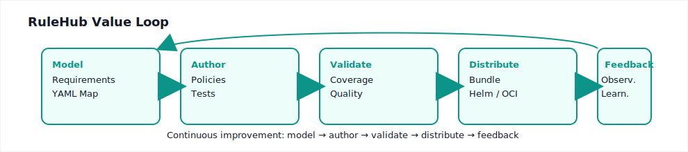
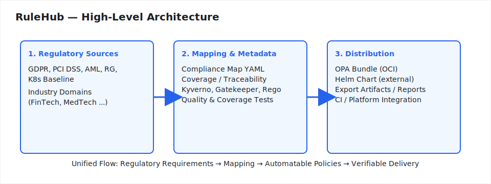

## RuleHub - Policy & Compliance, Beautifully Managed

[](https://github.com/rulehub/rulehub/actions/workflows/codeql.yml)
[](https://securityscorecards.dev/viewer/?uri=github.com/rulehub/rulehub)
[](LICENSE)

RuleHub is a policy & compliance hub that unifies requirements, policy code (Kyverno + OPA/Gatekeeper),
tests, metadata, integrity (bundles, SBOM, provenance), and docs into one auditable delivery pipeline.

Ship guardrails with confidence: measure coverage, enforce quality gates in CI, and publish signed,
reproducible policy bundles with a clear evidence trail from requirement -> rule -> test -> release.

---

## What RuleHub does

- Turns written requirements into verifiable policy code and tests.
- Tracks traceability: requirement mappings, rule metadata, test coverage, release artifacts.
- Automates quality gates in CI/CD across Kyverno and OPA/Gatekeeper.
- Produces supply-chain ready outputs: deterministic OPA bundles, SBOMs, signatures, and provenance.

<p align="center">
  
</p>

## Who it's for

- Security and Compliance teams needing fast, defensible audit evidence.
- Platform/DevOps teams standardizing cluster guardrails across tenants.
- Product teams in regulated spaces (fintech, health, gaming, education) where policy regressions are risky.

## Key features

- Compliance maps: model requirements alongside the policies that implement them.
- Multi-engine policy support: Kyverno and OPA/Gatekeeper with first-class tests.
- Policy quality gates: unit tests, coverage targets, static validation, guardrails.
- Reproducible delivery: deterministic bundles, integrity manifests, and signing.
- Rich metadata: ownership, references, and documentation that drive reports.
- Docs built-in: MkDocs site with architecture, integrity, coverage, and examples.

## Why teams choose RuleHub (differentiators)

- One hub for requirements, policy code, tests, and release evidence.
- CI-first: measurable coverage and enforceable thresholds to block regressions.
- Supply chain integrity by default: SBOMs, signatures, provenance, verification.
- Industry‑ready: curated policy sets and templates for common regulated domains.

## Screenshots & examples

> Replace or augment with your own product shots as the project evolves.

- Architecture (high-level):

  

- Example compliance map (YAML):

```yaml
id: CM-001
title: 'Network segmentation requirement'
controls: ['CIS-1.1']
owners: ['security@example.com']
policies:
  - kyverno/network-segmentation
```

- Example Kyverno snippet (illustrative):

```yaml
apiVersion: kyverno.io/v1
kind: ClusterPolicy
metadata:
  name: require-immutable-tags
spec:
  rules:
    - name: block-latest-tag
      match:
        resources:
          kinds: [Pod]
      validate:
        message: "Images must not use the 'latest' tag."
        pattern:
          spec:
            containers:
              - image: '!*:latest'
```

- Example Gatekeeper/Rego snippet (illustrative):

```rego
package kubernetes.admission

deny[msg] {
  input.review.object.kind == "Pod"
  some c
  c := input.review.object.spec.containers[_]
  endswith(c.image, ":latest")
  msg := "Images must not use the 'latest' tag."
}
```

## Minimal quick start

This is a tiny fast-path to see the repo structure and run a basic validation. For a full walkthrough, head to the docs.

1. Clone and enter the repository

```bash
git clone https://github.com/rulehub/rulehub.git
cd rulehub
```

1. Create a virtualenv and install dependencies

```bash
make setup-dev
make deps
```

1. Validate maps and metadata

```bash
make validate
```

Optional next steps:

- Run policy tests: `make test`
- Build docs locally: `make docs-serve`

## Learn more

- Getting started: docs/getting-started.md
- Architecture & policy model: docs/policy-architecture.md
- Metadata & compliance maps: docs/metadata.md and docs/compliance-maps.md
- Integrity, SBOM, signing: docs/security-integrity.md and docs/security-provenance.md
- Policy quality & coverage: docs/policy-test-quality.md and docs/coverage.md

## Contributing

Contributions and issues are welcome. Please read CONTRIBUTING.md and CODE_OF_CONDUCT.md before opening PRs.

## License

License: MIT - see LICENSE.
